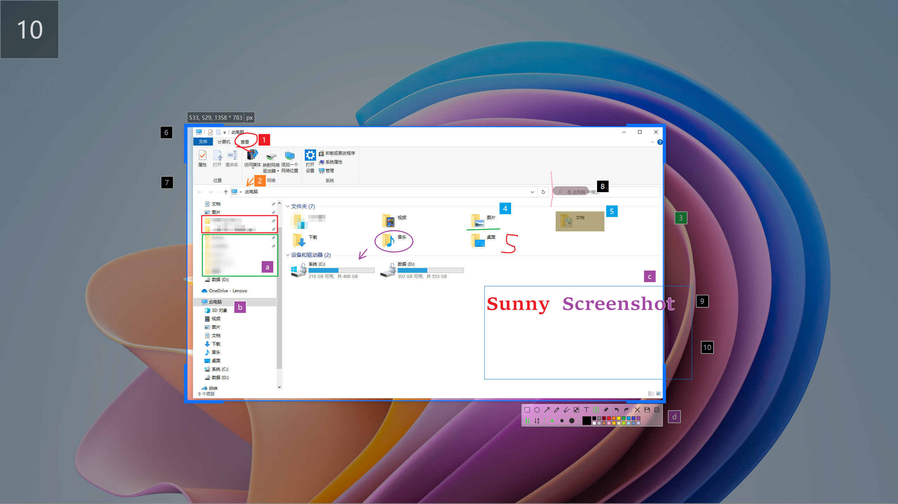

  

      <h1>
      
       
      Sunny
    </h1>
     
    <h4>Simple and beautiful screenshot software tool for Windows, MacOS and Linux</h4>
    <h4>简洁且漂亮的截图的软件工具，支持 Windows，MacOS，Linux 平台</h4>
    <h4>簡潔且漂亮的截圖的軟件工具，支持 Windows，MacOS，Linux 平臺</h4>
  

  

    
    
  
  

  
 <a href="index.md">English</a> | <a href="index.zh_CN.md">简体中文</a>

[TOC]

## Snapshoot

 

 **Other:** More snapshoot effects can be → [here](./snapshot) preview 

 

## Keyboard shortcuts

| Keys                                                         | Description                     | Mode   |
| ------------------------------------------------------------ | ------------------------------- | ------ |
| <kbd>F6</kbd>                                                | Window activation capture scree | Global |
| <kbd>Ctrl</kbd> + <kbd>F6</kbd>                              | Delay screen capture            | Global |
| <kbd>Shift</kbd> + <kbd>F6</kbd>                             | Custom size capture screen      | Global |
|                                                              |                                 |        |
| <kbd>←</kbd>, <kbd>↓</kbd>, <kbd>↑</kbd>, <kbd>→</kbd> ( <kbd>A</kbd>, <kbd>S</kbd>, <kbd>W</kbd>, <kbd>D</kbd> ) | Move selection 1px              | Local  |
| <kbd>Ctrl</kbd> + <kbd>←</kbd>, <kbd>↓</kbd>, <kbd>↑</kbd>, <kbd>→</kbd> | Extended selection 1 px         | Local  |
| <kbd>Alt</kbd> + <kbd>←</kbd>, <kbd>↓</kbd>, <kbd>↑</kbd>, <kbd>→</kbd> | Shrink selection 1 px           | Local  |
| <kbd>Shift</kbd> + <kbd>←</kbd>, <kbd>↓</kbd>, <kbd>↑</kbd>, <kbd>→</kbd> | Move selection 10 px            | Local  |
| <kbd>Shift</kbd> + <kbd>Ctrl</kbd> + <kbd>←</kbd>, <kbd>↓</kbd>, <kbd>↑</kbd>, <kbd>→</kbd> | Extended selection 10 px        | Local  |
| <kbd>Shift</kbd> + <kbd>Alt</kbd> + <kbd>←</kbd>, <kbd>↓</kbd>, <kbd>↑</kbd>, <kbd>→</kbd> | Shrink selection 10 px          | Local  |
| <kbd>Shift</kbd> + <kbd>F4</kbd>                             | Quick Save Image                | Local  |
| <kbd>Esc</kbd>                                               | Quit                            | Local  |

 

## Contributors

If it helps you, or find it useful, you can click on the item's**⭐Star** **🍴 Fork**  of the two icons, conveniently lift the hand between, said a point of praise the hand, There is a fragrance in your hand；The next best thing is to buy me a cold Coke.   

 

    
 <b>Of course you can also give a cold Coke [Donate/Reward ← Click to expand QR code]</b>

  
 - If you have something to learn from the project, you can also invite me to share a glass of Fat House Ice and Coke. - 

  <pre></pre>

 

## Package Download

 → Offline Installer Download [Releases](https://github.com/XMuli/SunnyPages/releases); 

Feedback BUG/SUGGEST, user community, etc.→   

 

## Development Experience Article

[QtExamples](https://github.com/XMuli/QtExamples) Welcome `star` ⭐ and `fork` 🍴 to this series of `C++ / QT / DTK` studies, Here you can learn the experience of how to write one of this software by yourself, it's a complete series and **it's free**!

